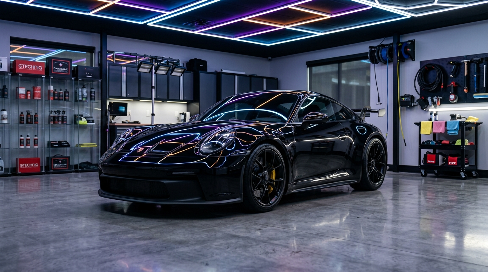

# ELİTE Auto Garage — Website

**One-page website for ELİTE Auto Garage, a car detailing and maintenance workshop in Kepez, Antalya.**


> Client project — designed and developed by Berke Coşkuner for **ELİTE Auto Garage**.

**Live:** [eliteautogarage.com](https://eliteautogarage.com)

<p align="center">
  
</p>

---

## Overview

A Turkish-language, dark and gold themed single-page website for ELİTE Auto Garage, a workshop in Kepez, Antalya that offers ceramic coating, paint correction and polishing, detailed interior / exterior cleaning and express oil change. The site introduces the workshop and its services, shows the results through a before / after slider and a gallery, and turns visitors into customers with WhatsApp quote buttons, click-to-call links and a map to the workshop.

## Features

- **Sticky header** with a blurred background on scroll, mobile menu and a WhatsApp contact button
- **Hero** section with a call to action for services and a direct WhatsApp link
- **About** section with a checklist of the workshop's focus areas and two photos of the work area
- **Services** — 4 cards: ceramic coating, paint polishing & correction, detailed interior & exterior cleaning, express oil change & maintenance, followed by a "get a quote on WhatsApp" button
- **Before / after slider** — draggable comparison (mouse and touch) for the paint correction result
- **Gallery** with a mixed-size image grid and a lightbox (previous / next / close, background scroll lock)
- **Contact** — phone, WhatsApp, address with a Google Maps link, working hours, a quick-quote card and an embedded map
- **Footer** with Instagram link and a scroll-to-top button
- **SEO** — Turkish metadata and keywords, Open Graph tags with a preview image, `robots.txt` and `sitemap.xml` via App Router metadata routes

## Tech stack

| Layer | Tools |
| --- | --- |
| Framework | Next.js 16 (App Router), React 19 |
| Language | TypeScript 5 |
| Styling | Tailwind CSS 4 (CSS variables mapped to `@theme` tokens) |
| Icons | lucide-react |
| Images & fonts | `next/image`, `next/font` (Inter, Montserrat) |
| Linting | ESLint 9 (`eslint-config-next`) |

## Project structure

```text
eliteautogarage007/
├── public/                   # hero-car, garage-bay, interior-detail,
│                             # wheel-detail and before-after-car images
├── src/
│   ├── app/
│   │   ├── layout.tsx        # Fonts, SEO metadata, Open Graph image
│   │   ├── page.tsx          # One-page layout (section order)
│   │   ├── globals.css       # Colour variables, Tailwind v4 theme, scrollbar
│   │   ├── robots.ts
│   │   └── sitemap.ts
│   └── components/
│       ├── Header.tsx, Hero.tsx, About.tsx, Services.tsx
│       ├── BeforeAfter.tsx   # Draggable comparison slider
│       ├── Gallery.tsx       # Grid + lightbox
│       └── Contact.tsx, Footer.tsx
└── next.config.ts
```

## Getting started

Requirements: Node.js 20+ and npm.

```bash
npm install
npm run dev      # http://localhost:3000
npm run lint
npm run build
npm run start
```

The `dev` and `build` scripts run with the `--webpack` flag instead of Turbopack. No environment variables are required.

## Editing content

| What | Where |
| --- | --- |
| Services | `src/components/Services.tsx` |
| About checklist | `src/components/About.tsx` |
| Gallery images and titles | `src/components/Gallery.tsx` |
| Phone, WhatsApp, address, working hours, map | `src/components/Contact.tsx` |
| Page title, description, keywords, OG image | `src/app/layout.tsx` |

---

## Türkçe

**Antalya Kepez'deki oto detailing ve bakım atölyesi ELİTE Auto Garage için tek sayfalık web sitesi.**

> Müşteri projesi — **ELİTE Auto Garage** için Berke Coşkuner tarafından tasarlandı ve geliştirildi.

**Canlı:** [eliteautogarage.com](https://eliteautogarage.com)

### Genel bakış

Antalya Kepez'de seramik kaplama, pasta cila ve boya düzeltme, detaylı iç / dış temizlik ve express yağ değişimi hizmeti veren ELİTE Auto Garage için hazırlanmış, koyu ve altın tonlarında, Türkçe tek sayfalık web sitesi. Site atölyeyi ve hizmetlerini tanıtır, sonuçları öncesi / sonrası slider'ı ve galeri ile gösterir; WhatsApp teklif butonları, tıkla-ara bağlantıları ve harita ile ziyaretçiyi müşteriye dönüştürmeyi hedefler.

### Özellikler

- Kaydırınca bulanık arka plana geçen sabit üst menü, mobil menü ve WhatsApp butonu
- Hizmetlere ve WhatsApp'a yönlendiren **hero** bölümü
- Atölyenin odak alanlarını listeleyen ve uygulama alanından fotoğraflar içeren **Hakkımızda** bölümü
- **Hizmetler** — seramik kaplama, pasta cila ve boya düzeltme, detaylı iç ve dış temizlik, express yağ değişimi ve bakım; ardından "WhatsApp ile Hızlı Teklif Al" butonu
- Fare ve dokunmatik ile sürüklenebilen **öncesi / sonrası** slider'ı
- Farklı boyutlu görsellerden oluşan **galeri** ve lightbox
- **İletişim** — telefon, WhatsApp, Google Haritalar bağlantılı adres, çalışma saatleri, hızlı teklif kartı ve gömülü harita
- Instagram bağlantısı ve yukarı çık butonu içeren **footer**
- **SEO** — Türkçe meta etiketler, önizleme görselli Open Graph, `robots.txt` ve `sitemap.xml`

### Teknolojiler

Next.js 16 (App Router), React 19, TypeScript, Tailwind CSS 4, lucide-react, `next/image`, `next/font` (Inter, Montserrat).

### Kurulum

```bash
npm install
npm run dev      # http://localhost:3000
npm run build && npm run start
```

`dev` ve `build` komutları Turbopack yerine `--webpack` ile çalışır. Ortam değişkeni gerekmez.

### İçerik düzenleme

- Hizmetler → `src/components/Services.tsx`
- Hakkımızda listesi → `src/components/About.tsx`
- Galeri → `src/components/Gallery.tsx`
- Telefon, WhatsApp, adres, çalışma saatleri, harita → `src/components/Contact.tsx`
- Sayfa başlığı, SEO ve OG görseli → `src/app/layout.tsx`

---

Built by [Berke Coşkuner](https://github.com/CoskunerBerke)
